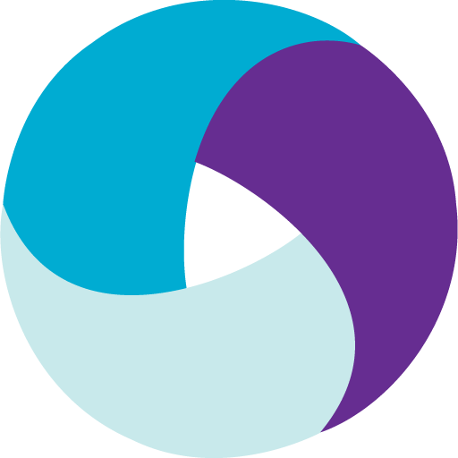

### Добро пожаловать! :slightly_smiling_face:
Меня зовут Ирина. Я - инженер по тестированию программного обеспечения :woman_technologist: </br>

  
  [](https://github.com/GithubRedMouth/github-readme-stats)

- Контакты:

  Email: neeiraaaa@gmail.com
<p>
  &#8287;&#8287;&#8287;&#8287;&#8287;
  <a href="https://t.me/neeiraaaa"></a>
  &#8287;

</p>

## 💻Стек и инструменты

<p  align="center">
  <code></code>
  <code></code>
  <code></code>
  <code></code>
  <code></code>
  <code></code>
  <code></code>
  <code></code>
  <code></code>
  <code></code>
  <code></code>

</p>

## Тестирование UI
:link: Тестовый проект: <a target="_blank" href="https://github.com/neeiraaaa/qa_quru_jenkins">UI_tests</a></br></br>
:heavy_check_mark: Реализованы автотесты UI на сайт DEMOQA </br></br>
:round_pushpin: Что особенного:

- [x] Page Object
- [x] Инкапсуляция
- [x] Интеграция с Allure report


## Тестирование REST API
:link: Тестовый проект: <a target="_blank" href="https://github.com/neeiraaaa/qa_quru_api_4">API_tests</a></br></br>
:heavy_check_mark: Реализованы автотесты Rest API на reqres.in и demowebshop.tricentis.com.</br></br>
:round_pushpin: Что особенного:

- [x] Шаблоны форматирования логов запросов
- [x] Проверка ответа сайта через Shema
- [x] Управление конфигом через pytest


## :computer: Запуск тестов из терминала
```bash
pytest tests/test_demoshop.py --env=prod
pytest tests/test_reqres.py --env=prod
```

## Тестирование мобильного приложения
:link: Тестовый проект: <a target="_blank" href="https://github.com/neeiraaaa/qa_quru_Android_Studio">Mobile_tests</a></br></br>
:heavy_check_mark: Реализованы автотесты мобильного приложения Wikipedia на эмуляторе мобильного устройства.</br></br>
:round_pushpin: Что особенного:

- [x] Интеграция с Browserstack
- [x] Степовой подход для описания Allure Step
- [x] Различные файлы конфигураций для запуска тестов

## :computer: Запуск тестов из терминала
```bash
env -S "context=browserstack" pytest .
env -S "context=emulation" pytest .
```

